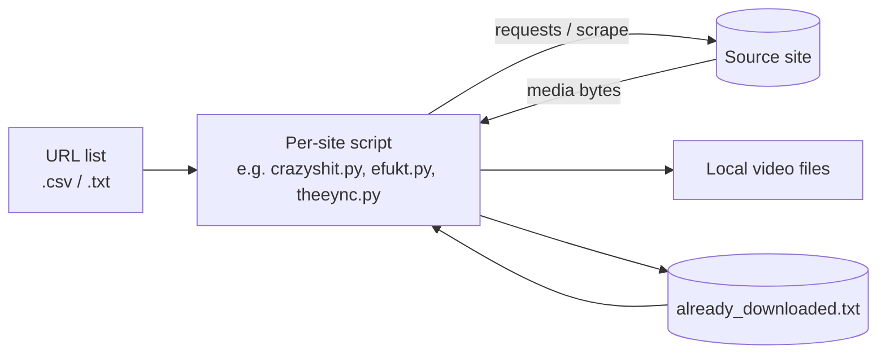

# video-download

> A personal collection of small Python scripts that download videos from a handful of sites, keeping a local ledger so nothing is fetched twice.

[](LICENSE)
[](https://github.com/chirag127/video-download/stargazers)
[](https://github.com/chirag127/video-download/commits)
[](https://python.org)

**GHP landing:** https://chirag127.github.io/video-download/ · **Repo:** https://github.com/chirag127/video-download

⭐ If this is useful, please **star the repo** — it helps others find it.

---

## What it is

`video-download` is a small, personal grab-bag of standalone Python scripts for bulk-downloading videos from a few specific sites. Each script targets one source, reads a list of URLs (usually from a `.csv`/`.txt`), downloads the media files, and appends what it fetched to an `already_downloaded.txt` ledger so re-runs skip anything you already have.

This is a utility collection, not a framework — each file is independent and does one thing.

## How it works



## Scripts

| Script | Source it targets |
|---|---|
| `videodownload.py` | Reads a CSV of URLs and downloads each, skipping ones already logged |
| `crazyshit.py` | Downloader for crazyshit |
| `efukt.py` | Downloader for efukt |
| `theeync.py` / `theeync/main.py` | Downloader for theync |
| `f.py`, `gd.py` | Small helper/one-off download scripts |

## Tech stack

- **Python 3.10+**
- `requests` for HTTP, plain-text/CSV lists for input, `already_downloaded.txt` as the dedupe ledger
- Linted with **Ruff** (config in `pyproject.toml`)

## Quick start

```bash
git clone https://github.com/chirag127/video-download && cd video-download
python -m venv .venv && source .venv/bin/activate   # optional
pip install requests

# Put your URLs in the relevant list file (e.g. deepgoretube.csv), then:
python videodownload.py
```

Each script writes downloaded filenames to `already_downloaded.txt`; delete or edit that file to force re-downloads.

## Repo structure

```
videodownload.py     # generic CSV-driven downloader
crazyshit.py         # per-site downloaders
efukt.py
theeync.py
theeync/main.py
f.py, gd.py          # helper scripts
*.csv, *.txt         # URL lists / download ledgers
pyproject.toml       # Ruff config
```

## Part of the oriz family

One of ~80 sites and tools in the **oriz** family — see [blog.oriz.in](https://blog.oriz.in) for how the fleet is built and run.

## Disclaimer

Personal tooling, provided as-is. Use responsibly and only where you have the right to download the content, and in line with each site's terms and your local laws.

## Contributing

Personal utility repo; issues/PRs welcome but not actively maintained. Conventional commits are the changelog.

## License

MIT © Chirag Singhal — chirag@oriz.in
